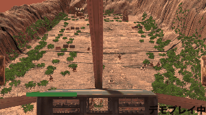
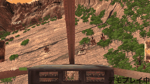

# 箱庭戦争

# description 
* タイトル:箱庭戦争
* ジャンル:一人称視点シューティング
* ターゲットプラットフォーム:PC
* 制作期間 製作期間 10/16〜11/10

# Demo
**Pleaze click image, then video will start.**

# Rule
* 敵の拠点を破壊することが目的です。 
* 敵の攻撃を複数回くらうと機体が制御できずに墜落してしまいます。 
* 照準を合わせることで、敵に攻撃を当てやすくなりますが、その分倒されやすくもなります。 

# Features
* 照準を合わせ、敵を攻撃する 
 
* 敵に攻撃された時の墜落モーション 
 

# Requirement
* Unity 2021.3.11f1

# Author
* 一ノ宮綾平
* 九州デザイナー学院ゲームCG学科ゲームプログラミング専攻
